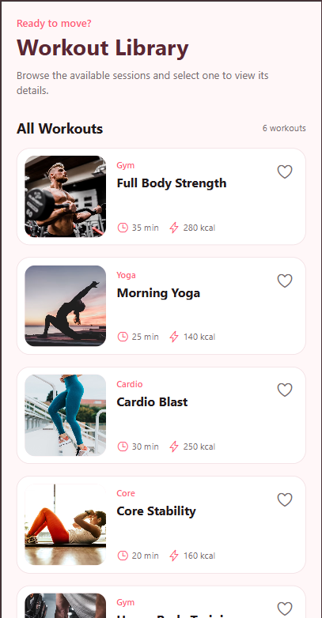
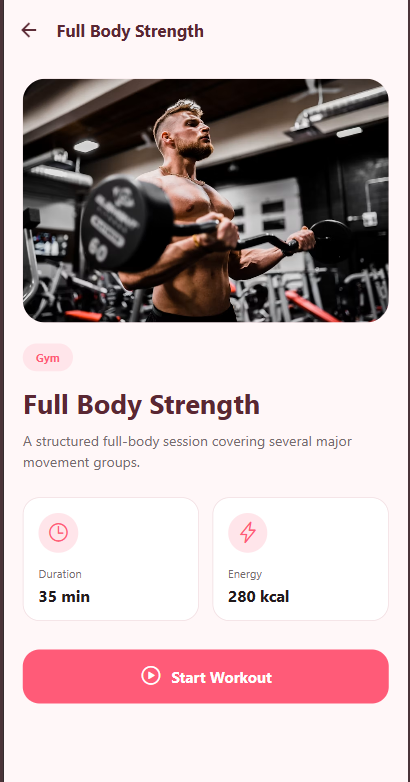
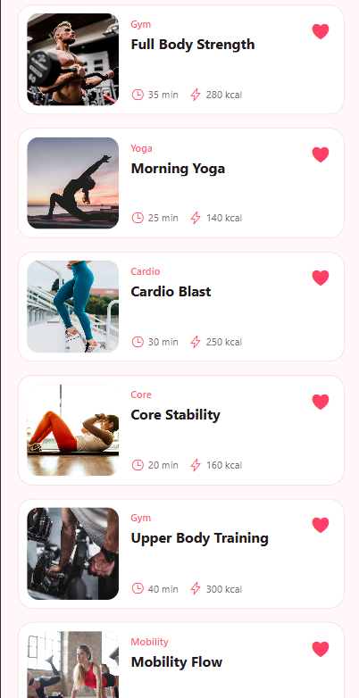

# Workout Library

A React Native fitness interface built with Expo for DCIT 324: Mobile Application Development. The application demonstrates reusable components, props, state, array mapping, stack navigation and route parameters.

## Features

- Reusable workout card component
- Six workout cards generated from an array
- Workout images, titles, duration and energy information passed through props
- Independent favourite state for every workout card
- Filled and unfilled favourite icons
- Workout list and workout details screens
- Native stack navigation between screens
- Selected workout data passed through route parameters
- Interactive `Start Workout` and `Completed` button
- Responsive and vertically scrollable interface
- Clean design inspired by the provided Figma reference

## Technologies Used

- React Native
- Expo
- JavaScript
- React Navigation
- Native Stack Navigator
- Expo Vector Icons
- Git
- GitHub

## Project Structure

```text
WorkoutApp/
├── components/
│   └── WorkoutCard.js
├── constants/
│   └── colors.js
├── data/
│   └── workouts.js
├── navigation/
│   └── AppNavigator.js
├── screens/
│   ├── WorkoutListScreen.js
│   └── WorkoutDetailsScreen.js
├── screenshots/
│   ├── workout-list.png
│   ├── workout-details.png
│   └── workout-favourites.png
├── assets/
├── App.js
├── app.json
├── index.js
├── package.json
└── package-lock.json
```

## Application Preview

### Workout List



### Workout Details



### Independent Favourites



## Installation and Setup

Download or clone the repository and open the project folder in Visual Studio Code.

Install the project dependencies:

```bash
npm install
```

Start the Expo development server:

```bash
npx expo start
```

The application can be opened using:

- Expo Go on a physical device
- Android emulator
- iOS simulator
- Web browser

If the development server encounters a cached error, restart it using:

```bash
npx expo start --clear
```

## Navigation

The application uses a native stack navigator with two screens:

1. `WorkoutList` displays all available workout cards.
2. `WorkoutDetails` displays information about the selected workout.

The selected workout is passed to the details screen through route parameters:

```javascript
navigation.navigate("WorkoutDetails", {
  workout: workout,
});
```

The details screen accesses the selected workout using:

```javascript
const { workout } = route.params;
```

## Reusable Components and Props

The `WorkoutCard` component receives the following values through props:

- `image`
- `title`
- `category`
- `duration`
- `calories`
- `onPress`

The workout list maps over the workout array and produces a reusable card for every workout.

## State Management

Each workout card contains an independent favourite state:

```javascript
const [isFavourite, setIsFavourite] = useState(false);
```

The workout-details screen contains a completion state:

```javascript
const [isCompleted, setIsCompleted] = useState(false);
```

This state changes the action button between:

- `Start Workout`
- `Completed`

## Assignment Requirements Completed

- Created a new Expo project
- Built a reusable workout card component
- Passed image, title, duration and energy information through props
- Rendered six workout cards by mapping over an array
- Added independently controlled favourite icons
- Configured a native stack navigator
- Opened the details screen by tapping a workout card
- Passed selected workout data through route parameters
- Added an interactive completion button
- Used simple icons, flat colours and a clean interface
- Pushed the complete project to GitHub

## Student Information

**Name:** Gyabaah Felix  
**Student ID:** 11227253  
**Course:** DCIT 324: Mobile Application Development  
**Institution:** University of Ghana

## Course Information

**Course:** DCIT 324: Mobile Application Development  
**Department:** Department of Computer Science  
**Institution:** University of Ghana  
**Submission Mode:** Individual